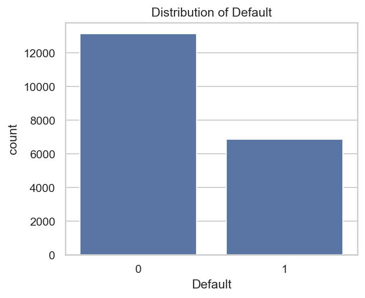
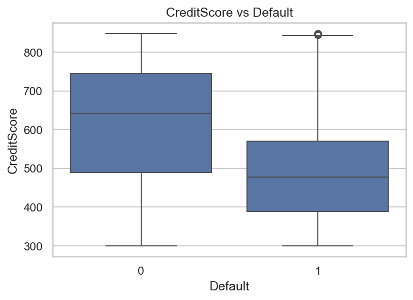
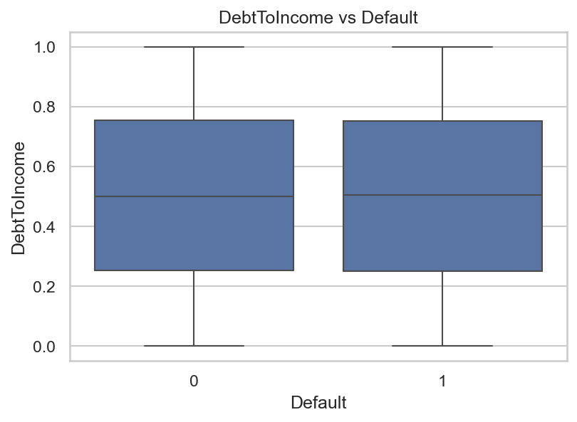
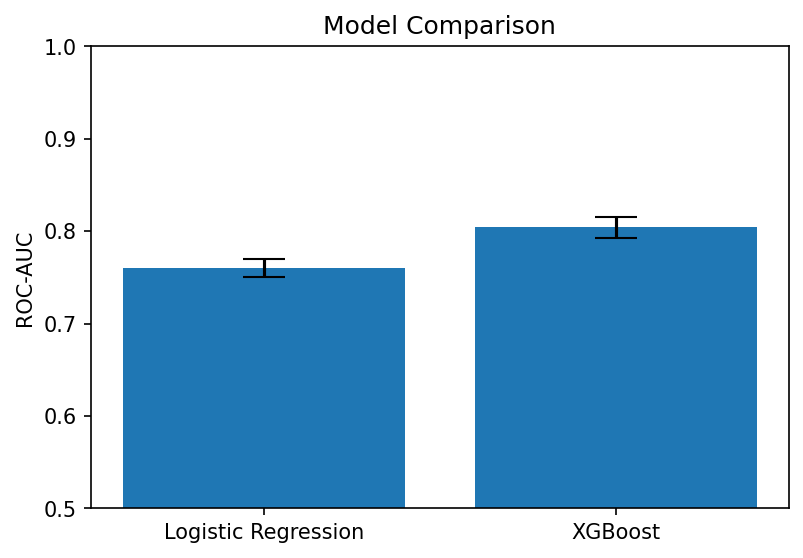
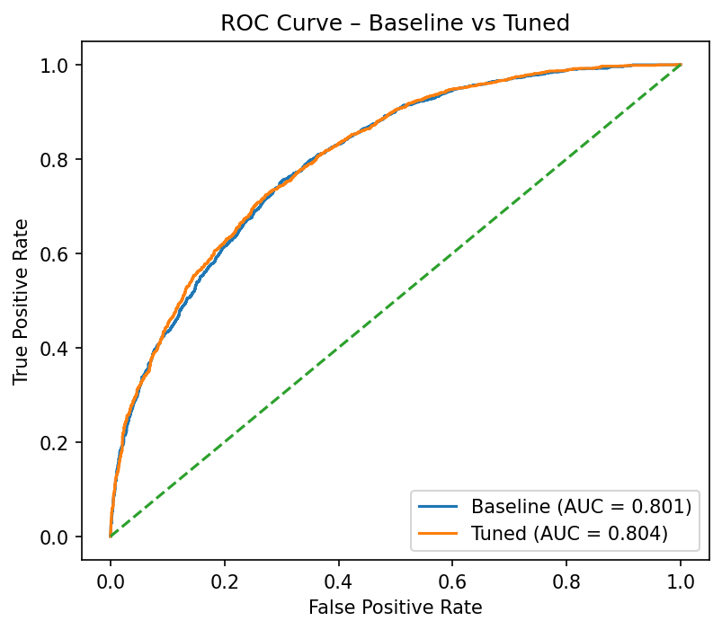
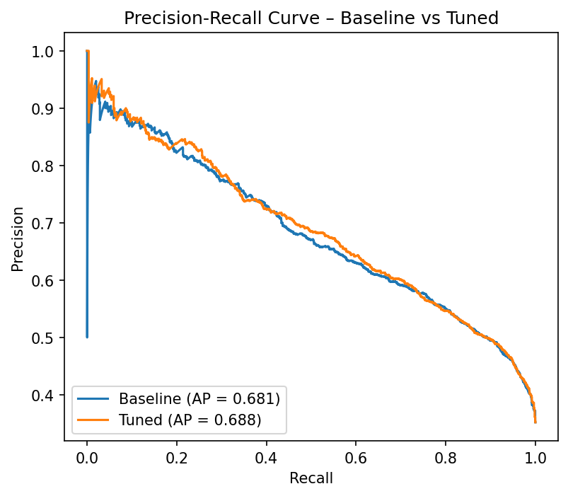
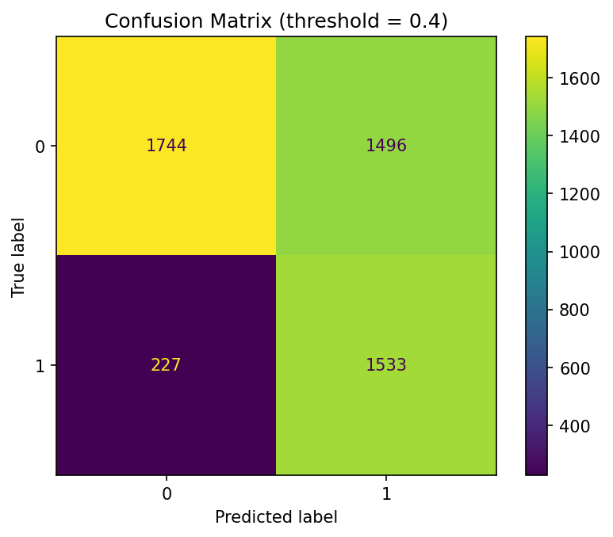
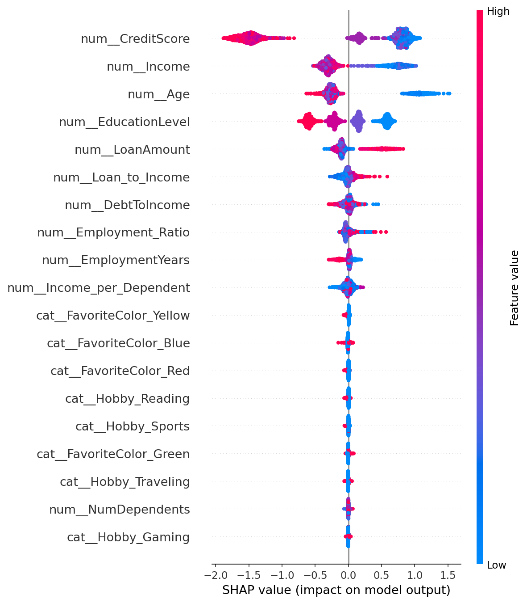
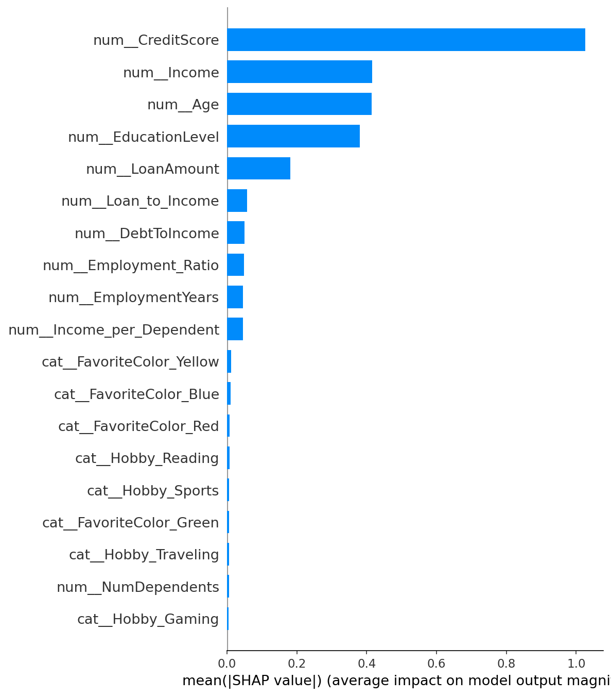
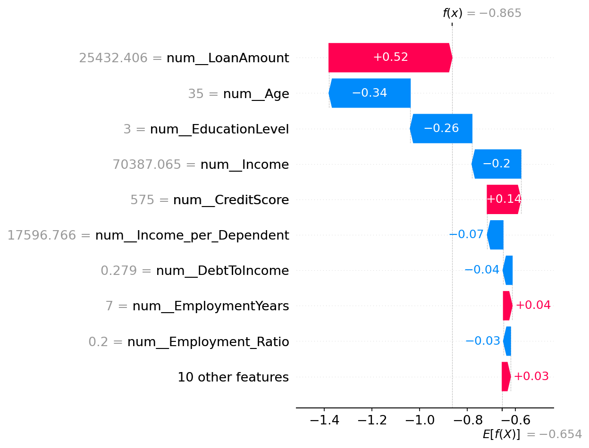

# Credit Risk Prediction – End-to-End Case Study

## Executive Summary

Celem projektu było zbudowanie modelu predykcyjnego wspierającego decyzje kredytowe poprzez estymację ryzyka niespłacenia zobowiązania. Na bazie danych klientów opracowano pipeline ML oparty o XGBoost, osiągający ROC-AUC na poziomie ~0.80 oraz umożliwiający świadome sterowanie polityką ryzyka poprzez regulację progu decyzyjnego. Model został wzbogacony o warstwę interpretowalności (SHAP), dzięki czemu każda decyzja może być uzasadniona w sposób zrozumiały dla zespołów biznesowych.  
Rozwiązanie pozwala ograniczyć liczbę kosztownych błędów (False Negative), przy jednoczesnym zachowaniu kontroli nad doświadczeniem klienta. Projekt pokazuje, w jaki sposób ML może pełnić rolę warstwy preselekcji w procesie kredytowym, wspierając – a nie zastępując – decyzję człowieka.

## 1. Problem biznesowy

Instytucje finansowe udzielające kredytów muszą każdego dnia podejmować decyzje,
które bezpośrednio wpływają na poziom ryzyka oraz stabilność finansową banku.
Kluczowym wyzwaniem jest ocena prawdopodobieństwa, że dany klient nie spłaci
swojego zobowiązania w terminie (tzw. default).

Błędna decyzja kredytowa może prowadzić do dwóch kosztownych scenariuszy:

- **Fałszywie negatywny (False Negative)** – klient wysokiego ryzyka zostaje
  zakwalifikowany jako bezpieczny i otrzymuje kredyt, którego nie spłaci.
  Skutkuje to realną stratą finansową dla banku.
- **Fałszywie pozytywny (False Positive)** – klient niskiego ryzyka zostaje
  odrzucony, mimo że mógłby terminowo spłacać zobowiązanie.
  Prowadzi to do utraty potencjalnego przychodu oraz pogorszenia doświadczenia klienta.

Celem projektu jest zbudowanie modelu predykcyjnego, który na podstawie danych
o kliencie estymuje prawdopodobieństwo niespłacenia kredytu i wspiera proces
podejmowania decyzji kredytowych.

Model nie zastępuje decyzji analityka kredytowego, lecz stanowi narzędzie
wspomagające – pozwala szybciej identyfikować klientów podwyższonego ryzyka,
optymalizować próg decyzyjny oraz ograniczać straty wynikające z nietrafnych decyzji.

## 2. Dane

Projekt oparty jest na dwóch zbiorach danych:

- zbiór treningowy: 20 000 obserwacji,
- zbiór testowy: 5 000 obserwacji,

Każdy rekord opisuje jednego klienta i zawiera 11 zmiennych, w tym:

- cechy demograficzne i finansowe, m.in.:
  - `Age` – wiek klienta,
  - `Income` – dochód,
  - `CreditScore` – scoring kredytowy,
  - `EmploymentYears` – lata zatrudnienia,
  - `DebtToIncome` – relacja zadłużenia do dochodu,
- cechy dodatkowe:
  - `EducationLevel`,
  - `FavoriteColor`,
  - `Hobby`,
- zmienną docelową:
  - `Default` – informacja, czy klient nie spłacił kredytu (1) czy spłacił go terminowo (0).

Zmienna docelowa ma rozkład:

- klasa 0 (brak defaultu): ~65.7%,
- klasa 1 (default): ~34.3%.

Oznacza to umiarkowane niezbalansowanie klas – większość klientów spłaca zobowiązania,
jednak ponad 1/3 przypadków stanowią klienci wysokiego ryzyka.
Ma to bezpośrednie znaczenie dla dalszych etapów modelowania,
w szczególności doboru metryk oraz interpretacji wyników modelu.

## 3. Exploratory Data Analysis (EDA)

Dane zawierają zarówno cechy numeryczne (wiek, dochód, scoring kredytowy, kwota kredytu),
jak i kategoryczne (hobby, ulubiony kolor).

Już na etapie wstępnej inspekcji widoczne są potencjalne problemy jakości danych:

- zmienna `CreditScore` zawiera braki (~12% obserwacji),
- w zmiennych `Income` oraz `LoanAmount` pojawiają się wartości ujemne,
  które w kontekście biznesowym są trudne do interpretacji,
- zakresy niektórych cech są szerokie, co może sprzyjać obecności wartości odstających.

Te obserwacje wskazują, że przed budową modelu konieczne będzie:
- zaprojektowanie strategii imputacji braków danych,
- weryfikacja i obsługa nielogicznych wartości,
- analiza wpływu potencjalnych outlierów na proces uczenia modelu.

*Rozkład pokazuje umiarkowane niezbalansowanie klas – większość klientów spłaca zobowiązania, jednak ponad 1/3 przypadków stanowią klienci wysokiego ryzyka, co ma bezpośredni wpływ na dobór metryk i strategię walidacji modelu.*
    

*Wykres pokazuje, że wraz ze spadkiem CreditScore wyraźnie rośnie udział klientów trafiających do klasy Default. To najsilniejszy pojedynczy sygnał ryzyka w danych i naturalny fundament dla dalszego modelowania.*

*Wartość wskaźnika Debt-to-Income pokazuje, że ryzyko nie wynika z jednej cechy wprost – rozkłady klas przenikają się. Oznacza to, że sam poziom zadłużenia nie wystarcza do jednoznacznej oceny klienta, a ryzyko ma charakter wielowymiarowy. To uzasadnia potrzebę zastosowania modelu, który potrafi łączyć wiele sygnałów jednocześnie.*

### Łącznie wykresy pokazują, że ryzyko kredytowe ma charakter wielowymiarowy – nie wynika z jednej cechy, lecz z kombinacji profilu finansowego i życiowego klienta. To uzasadnia zastosowanie modelu, który potrafi uchwycić nieliniowe zależności między cechami.
    
### Podsumowanie EDA – perspektywa decyzyjna

**Co widzimy?**  
Dane charakteryzują się ogólnie wysoką jakością. Zmienna docelowa jest umiarkowanie
niezbalansowana, występują braki w `CreditScore` oraz pojedyncze wartości trudne
do interpretacji biznesowej w niektórych cechach numerycznych.  
W analizie relacji z `Default` wyraźnie wyróżnia się `CreditScore`, natomiast inne
zmienne, takie jak `DebtToIncome`, wykazują słabszą, lecz istotną zależność.
Cechy kategoryczne nie posiadają jednoznacznego uzasadnienia biznesowego.

**Dlaczego to ma znaczenie?**  
Jakość danych oraz rozkład klas wpływają bezpośrednio na wybór metryk,
strategii walidacji oraz sposobu przygotowania cech. Obserwowane zależności
wskazują, że skuteczna predykcja ryzyka nie może opierać się na pojedynczym
wskaźniku, lecz wymaga modelu uwzględniającego wiele aspektów profilu klienta.

**Jak to wpływa na model / biznes?**  
Na podstawie EDA:
- zastosowana zostanie imputacja braków w `CreditScore`,
- wykorzystane zostaną metryki odporne na niezbalansowanie klas (ROC-AUC, recall),
- model będzie budowany w sposób wielowymiarowy,
- wartość cech kategorycznych zostanie zweryfikowana empirycznie w trakcie uczenia.

Tym samym EDA stanowi fundament dalszych etapów projektu – od przygotowania
danych, przez budowę modelu, aż po interpretację wyników w kontekście biznesowym.

## 4. Feature Engineering

W etapie Feature Engineering dane zostały nie tylko oczyszczone, ale także wzbogacone
o kilka prostych, biznesowo uzasadnionych cech (np. relacje dochodu do liczby osób
na utrzymaniu czy kwoty kredytu). Celem było lepsze uchwycenie rzeczywistego
obciążenia finansowego klienta bez wprowadzania nadmiernej złożoności.

Zastosowane transformacje są deterministyczne, nie powodują wycieku informacji
(data leakage) i mogą być wprost użyte w środowisku produkcyjnym.

Na podstawie porównania modeli w walidacji krzyżowej jako model bazowy wybrano
**XGBoost**, który wykazał wyraźnie lepszą zdolność do separacji klientów
wysokiego i niskiego ryzyka przy zachowaniu stabilnych wyników.

*Porównanie modeli w walidacji krzyżowej pokazuje, że XGBoost wyraźnie przewyższa regresję logistyczną zarówno pod względem średniego ROC-AUC, jak i stabilności wyników. Wybór tego algorytmu nie jest więc arbitralny – wynika bezpośrednio z empirycznej oceny jakości predykcji.*

### Na tym etapie pipeline przechodzi z fazy eksploracyjnej w fazę inżynierską – dalsze kroki koncentrują się już na świadomym kształtowaniu zachowania wybranego modelu.  

## 5. Model bazowy
Celem tego etapu było zbudowanie prostego, ale kompletnego modelu bazowego,
który posłuży jako punkt odniesienia dla dalszych ulepszeń.

Zastosowano podejście pipeline’owe, łączące:

- przygotowanie danych:
  - imputację braków (median / most_frequent),
  - skalowanie cech numerycznych,
  - kodowanie kategorii (One-Hot Encoding),
- model predykcyjny: `XGBoostClassifier`.

Pipeline zapewnia:
- brak wycieku danych (wszystkie transformacje uczone tylko na train),
- powtarzalność eksperymentów,
- możliwość łatwego tuningu i porównań.

Model został wytrenowany na zbiorze treningowym i oceniony na zbiorze testowym.

Wyniki bazowe (threshold = 0.50):

- ROC-AUC ≈ 0.80  
- PR-AUC ≈ 0.68  

Oznacza to, że model:

- dobrze rozróżnia klientów niskiego i wysokiego ryzyka (ROC-AUC),
- wykrywa ponad połowę klientów, którzy faktycznie nie spłacą zobowiązania,
- zachowuje rozsądną równowagę między skutecznością a stabilnością.

Ten model traktujemy jako **baseline** – nie jako rozwiązanie finalne,
ale jako solidny punkt wyjścia do:

- regulacji progu decyzyjnego,
- tuningu hiperparametrów,
- porównań z innymi konfiguracjami,
- interpretacji predykcji (SHAP).

W kolejnych krokach pokażemy, jak świadomie sterować zachowaniem modelu
w zależności od celów biznesowych.

Oznacza to, że model:

- dobrze rozróżnia klientów niskiego i wysokiego ryzyka (ROC-AUC),

- wykrywa ponad połowę klientów, którzy faktycznie nie spłacą zobowiązania,

- zachowuje rozsądną równowagę między skutecznością a stabilnością.

W kolejnych krokach pokażemy, jak świadomie sterować zachowaniem modelu
w zależności od celów biznesowych.    
    

## 6. Tuning i walidacja

Model bazowy daje solidne wyniki, ale jego zachowanie można jeszcze świadomie kształtować.
W tym etapie skupiamy się na dwóch kluczowych aspektach:

1. **Walidacja krzyżowa (Cross-Validation)** – aby upewnić się, że model jest stabilny  
   i nie „uczy się na pamięć” jednego konkretnego podziału danych.
2. **Tuning hiperparametrów** – aby znaleźć konfigurację, która lepiej równoważy:
   - skuteczność wykrywania ryzykownych klientów (recall),
   - precyzję decyzji (precision),
   - ogólną jakość predykcji (ROC-AUC, F1).

Zastosowaliśmy `RandomizedSearchCV` z walidacją krzyżową, przeszukując przestrzeń
najważniejszych parametrów XGBoosta:

Celem optymalizacji była metryka **ROC-AUC**, która najlepiej odzwierciedla zdolność
modelu do rozróżniania klientów niskiego i wysokiego ryzyka niezależnie od progu decyzyjnego.

Wynik tuningu:

ROC-AUC (CV): ~0.806
Najlepsze parametry:
- n_estimators: 200
- max_depth: 3
- learning_rate: 0.03
- subsample: 0.7
- colsample_bytree: 0.7
- min_child_weight: 10
- gamma: 0

*Krzywa ROC pokazuje zdolność modelu do separacji klientów niskiego i wysokiego ryzyka w całym zakresie progów decyzyjnych. Model po tuningu utrzymuje wyższe wartości AUC, co oznacza lepsze rozróżnianie przypadków defaultu niezależnie od przyjętej polityki decyzyjnej. Tuning nie jest więc kosmetyczną zmianą – realnie poprawia jakość predykcji.*

*Krzywa Precision–Recall lepiej oddaje zachowanie modelu w kontekście klasy rzadkiej (Default), która jest kluczowa z perspektywy ryzyka biznesowego. Model po tuningu utrzymuje wyższy poziom precyzji przy porównywalnym recall, co oznacza mniej fałszywych alarmów przy tej samej skuteczności wykrywania klientów wysokiego ryzyka. W praktyce przekłada się to na mniejszą liczbę niepotrzebnych odrzuceń przy zachowaniu kontroli nad stratami.*

### Na tym etapie model przestaje być jedynie poprawną implementacją algorytmu, a staje się świadomie kształtowanym narzędziem decyzyjnym – jego zachowanie można mierzyć, porównywać i optymalizować wprost pod potrzeby biznesu.

## 7. Ewaluacja na zbiorze testowym

Po tuningu modelu przechodzimy do jego ostatecznej oceny na **niezależnym zbiorze testowym**.
To kluczowy moment – dopiero tutaj widzimy, jak system zachowa się w realnym scenariuszu.

W przeciwieństwie do walidacji krzyżowej, zbiór testowy:
- nie był używany ani do uczenia,
- ani do strojenia hiperparametrów,
- stanowi więc uczciwą symulację „produkcji”.

Do oceny wykorzystujemy:

- **ROC-AUC** – globalną zdolność modelu do rozróżniania klas,
- **PR-AUC** – jakość predykcji w kontekście klasy rzadkiej (Default),
- **confusion matrix** – rzeczywiste konsekwencje decyzji,
- **precision / recall** – w szczególności dla klasy *Default = 1*.

W kontekście bankowym elementy macierzy pomyłek interpretujemy następująco:

| Rzeczywistość / Predykcja | 0 – bezpieczny | 1 – default |
|---------------------------|----------------|-------------|
| **0 – klient OK**         | TN – poprawna akceptacja | FP – odrzucony mimo że był OK |
| **1 – klient zbankrutuje**| FN – *przepuszczony ryzykowny klient* ❌ | TP – poprawnie wykryty default |

Najdroższym błędem z perspektywy banku jest **FN (False Negative)** –  
klient, który zbankrutuje, a model uzna go za bezpiecznego.

Dlatego w tym etapie:

- analizujemy confusion matrix,
- porównujemy różne wartości progu decyzyjnego (np. 0.50, 0.40, 0.35),
- obserwujemy, jak zmienia się kompromis między:
- wykrywaniem ryzykownych klientów (recall klasy *Default*),
- a liczbą fałszywych alarmów (precision).

Pokazuje to, że model nie ma jednej „najlepszej” konfiguracji –
każda wartość progu reprezentuje inną **politykę ryzyka**:

- wyższy próg → więcej zaakceptowanych klientów, większe ryzyko strat,
- niższy próg → mniej strat finansowych, więcej odrzuconych „dobrych” klientów.

W ten sposób model przestaje być tylko algorytmem klasyfikacji,
a staje się **narzędziem wspierającym decyzje biznesowe**,
którego zachowanie można świadomie dostosować do strategii firmy.

### Dla progu decyzyjnego 0.40 model osiąga następujący rozkład decyzji:

- **True Negative (1744)** – poprawnie zaakceptowani klienci niskiego ryzyka,  
- **False Positive (1496)** – klienci bezpieczni, którzy zostali niepotrzebnie odrzuceni,  
- **False Negative (227)** – klienci wysokiego ryzyka przepuszczeni przez system (najdroższy błąd),  
- **True Positive (1533)** – poprawnie wykryci klienci, którzy nie spłacą zobowiązania.

### Macierz pokazuje, że obniżenie progu do 0.40 znacząco redukuje liczbę najdroższych błędów (FN), kosztem wzrostu liczby fałszywych alarmów (FP). W praktyce oznacza to przesunięcie polityki decyzyjnej w stronę większej ostrożności – bank traci część potencjalnych klientów, ale ogranicza ekspozycję na realne straty finansowe. 
To pokazuje, że wybór progu nie jest parametrem technicznym, lecz elementem świadomej polityki ryzyka.

## 8. Explainability (SHAP)

Model został uzupełniony o warstwę interpretowalności z wykorzystaniem biblioteki SHAP (SHapley Additive exPlanations).

Dzięki temu możliwe było:
- zidentyfikowanie kluczowych czynników wpływających default” / „ryzyko niespłacenia (globalnie),
- wyjaśnienie pojedynczych decyzji modelu dla konkretnych klientów,
- zwiększenie transparentności rozwiązania – istotnej w kontekście sektora finansowego.

W praktyce oznacza to, że model nie jest „czarną skrzynką”:
dla każdej predykcji można wskazać, które cechy podnoszą, a które obniżają
prawdopodobieństwo odejścia klienta.

Taki poziom interpretowalności:
- wspiera zespoły biznesowe w projektowaniu działań retencyjnych,
- umożliwia audyt decyzji modelu,
- zwiększa zaufanie do systemów opartych o ML.

Wykres SHAP Summary pokazuje globalny obraz działania modelu.

- Oś pozioma (X) przedstawia wpływ danej cechy na predykcję – wartości po prawej stronie zwiększają prawdopodobieństwo defaultu, a po lewej je obniżają.
- Kolor punktów oznacza wartość cechy: niebieski odpowiada niskim wartościom, czerwony – wysokim.
- Długość „chmury” dla danej zmiennej odzwierciedla jej znaczenie w modelu.

Wyraźnie widać, że `CreditScore` dominuje nad pozostałymi cechami – zarówno niskie, jak i wysokie wartości tej zmiennej silnie wpływają na decyzje modelu. Pozostałe zmienne, takie jak `Income`, `DebtToIncome` czy `Age`, pełnią rolę uzupełniającą, kształtując profil ryzyka w bardziej subtelny sposób.

Rozkład punktów pokazuje również, że model uczy się zależności nieliniowych – ten sam atrybut może działać różnie w zależności od swojego poziomu oraz kontekstu pozostałych cech. Oznacza to, że predykcja nie opiera się na prostych progach, lecz na złożonym obrazie sytuacji finansowej klienta.

Wersja słupkowa porządkuje cechy według ich średniego wpływu na predykcje. 
Potwierdza ona dominującą rolę `CreditScore` oraz pokazuje, że pozostałe zmienne
(`Income`, `DebtToIncome`, `Age`) współtworzą profil ryzyka w sposób komplementarny.

Wykres pokazuje, w jaki sposób poszczególne cechy wpłynęły na decyzję modelu
dla konkretnego klienta. Cechy zaznaczone na czerwono zwiększają ryzyko,
a niebieskie je obniżają. Model buduje predykcję jako sumę tych wpływów,
zaczynając od wartości bazowej populacji.

Dzięki temu każda decyzja może być uzasadniona w sposób zrozumiały
dla analityka kredytowego – system nie tylko wskazuje wynik, ale także
pokazuje, *dlaczego* został on osiągnięty.

W praktycznym zastosowaniu oznacza to, że model może pełnić rolę nie tylko predykcyjną, ale także diagnostyczną. Zamiast samego „tak / nie” dla wniosku kredytowego, system dostarcza uzasadnienie decyzji: które czynniki zwiększyły ryzyko i w jakim stopniu. Pozwala to traktować model jako narzędzie wspierające analityka – wskazujące obszary wymagające uwagi, a nie jako automatycznego sędziego.    

### Dzięki warstwie explainability model przestaje być wyłącznie narzędziem predykcyjnym, a staje się systemem wspierającym decyzje. Łączy on wysoką skuteczność z przejrzystością – umożliwia zarówno ocenę ryzyka w skali całej populacji, jak i zrozumienie pojedynczych przypadków. Taka architektura pozwala bezpiecznie integrować ML z procesem biznesowym, zachowując kontrolę człowieka nad ostateczną decyzją.
    

## 9. Wnioski biznesowe
- Credit Score
To najsilniejszy sygnał ryzyka.
➜ Rekomendacja: klienci z pogarszającym się scoringiem powinni być objęci wczesnym systemem ostrzegania (early warning). Zanim dojdzie do faktycznego problemu – propozycja restrukturyzacji, zmiany harmonogramu, kontakt doradcy.

- Income & Age (prawie ex aequo)
Dochód i etap życia są kluczowe dla stabilności finansowej.
➜ Rekomendacja: segmentować klientów nie tylko po produkcie, ale po „stabilności ekonomicznej”. Młodsi z niskim dochodem = inny typ ryzyka niż starsi z wysokim.

- Education Level
Wykształcenie koreluje z przewidywalnością sytuacji finansowej.
➜ Rekomendacja: traktować je nie jako kryterium decyzyjne, lecz jako kontekst ryzyka – np. przy podobnym Credit Score dwóm klientom można zaproponować inne ścieżki oferty/komunikacji.

- LoanAmount oraz wskaźniki zadłużenia
Mają mniejszy, ale nadal istotny wpływ.
➜ Rekomendacja: nie skupiać się wyłącznie na wysokości kredytu, lecz na relacji zobowiązań do realnych możliwości klienta.

Na podstawie analizy SHAP rekomendowałbym zespołowi kredytowemu odejście od podejścia opartego wyłącznie na pojedynczych progach (np. minimalny Credit Score) na rzecz bardziej kontekstowego modelu zarządzania ryzykiem.

W pierwszej kolejności warto monitorować negatywne zmiany w czasie – zwłaszcza pogarszający się Credit Score, który okazał się najsilniejszym sygnałem ryzyka. W takich przypadkach system mógłby automatycznie uruchamiać działania prewencyjne, takie jak:
- kontakt doradcy z klientem,
- propozycja zmiany harmonogramu spłat,
- wczesna oferta restrukturyzacji zobowiązania.

Model pokazuje również, że istotną rolę odgrywają wiek oraz poziom dochodów. Ta sama wartość ryzyka może oznaczać zupełnie inną sytuację w zależności od etapu życia klienta. Osoba młodsza z niskim dochodem powinna być postrzegana inaczej pod względem stabilności finansowej niż osoba starsza z wysokim i ugruntowanym poziomem przychodów. Dlatego rekomendowana jest bardziej zrównoważona segmentacja klientów, uwzględniająca kontekst ekonomiczny, a nie tylko pojedyncze wskaźniki.

Poziom wykształcenia, choć nie powinien stanowić samodzielnego kryterium decyzyjnego, może pełnić rolę dodatkowego markera. W sytuacjach, gdy klienci mają podobny Credit Score, może on pomóc w doborze odpowiedniej ścieżki oferty lub sposobu komunikacji – zamiast stosowania jednego, uniwersalnego scenariusza dla wszystkich.

### Model może być użyty jako warstwa preselekcji w procesie kredytowym, skracając czas decyzji i redukując ekspozycję na ryzyko przy zachowaniu kontroli człowieka. W praktyce oznacza to szybszą obsługę klientów niskiego ryzyka oraz wcześniejsze wychwytywanie przypadków wymagających interwencji analityka.